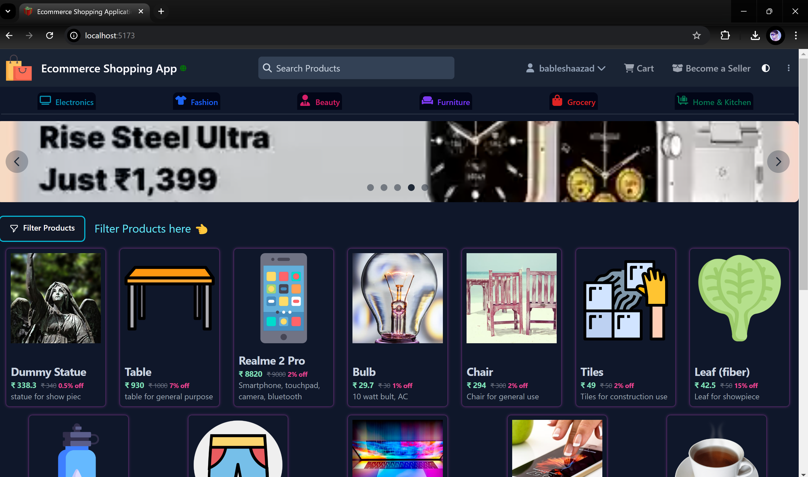

## 🏪 E-Commerce Shopping Web Application [ecommerce.BableshAAzad.com](https://ecommerce.bableshaazad.com)
- This project is make using Reactjs+Vite app and backend is Java Spring Boot.
- It is a kind of prototype application of FlipKart.com. For a demo, visit [ecommerce.BableshAAzad.com](https://ecommerce.bableshaazad.com).

**📜 API Documentation:**
- View ecommerce shopping app api documentation [ecommerce-shopping-app-api](https://github.com/BableshAAzad/Ecommerce_Shopping_App)
- View store house management system api documentation [store-house-management-system-api](https://github.com/BableshAAzad/Store_House_Management_System)
---
**🏠 Features:**
>- Login using Username and Password, providing an Access Token and Refresh Token (AT and RT).
>- Login using OAuth2, supporting login with Google or GitHub.
>
>**For Customers:**
>- Search, filter, categorize products, view product information, and place orders.
>- Manage the shopping cart, view added products, and proceed with orders.
>- View past orders and download invoices.
>
>**For Sellers:**
>- Allow sellers to add, update, and delete products.
>- Search warehouses based on proximity to your location to store products.
>- View products and storage information by seller.

**🧑‍💻 Technologies Used:**

`Reacjs+Vite` `react-router-dom` `Protected-Router` `Tailwind css` `Axiox` `flowbite` `flowbite-react` `react-top-loading-bar` `react-infinite-scroll-component`

---

**💻 How Use Source code:**
- Download the master branch as a zip file
- After extracting zip file, install npm in root directory
- Inside folder: set your backend application url 👇
```bash
root_directory/
├── src/
│   ├── app/
│   │   ├── components/
│   │   │   ├─ appconstants//
│   │   │   │   └── EcommerceUrl.jsx/
│   │   │   │      └── BASE_URL/      
````
---
#### 📝 Examples
<p align="center">
  
  
</p>
